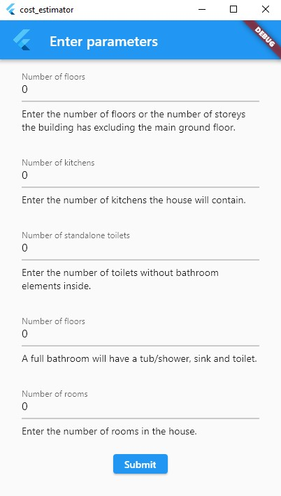

# Cost Estimator

```
Project commenced: 09/02/2023

Project completed: 16/02/2023

```

This a Flutter Application for estimating the costs of building a house.

## Screenshots



## Folder Structure

- components/
- logic/
- screens/
  - details/
  - form/
  - intro/
- main.dart

## Screens

The application has 3 screens stored in spearate folders in the `screens` folder.

### Intro Screen

The application makes use of a simple slider for introduction showcasing the benefits of using the app.

### Form Screen

The form collects the various data from the user. The data is stored in a `CostInfoMap`. When <button>Estimate cost</button> is clicked, a modal dialog is created showing the user the estimated cost of building the house. The dialog contains a button to show a breakdown of the results of the calculation were arrived at.

### Details Screen

The details screen shows a detailed breakdown of the various components of the cost arrived at.

## Logic

The application uses two classes to estimate the cost of a building.

- `CostInfo` class
- `PriceList` class

The `CostInfo` class uses a bunch of heuristics to estimate the requirements for constructing a building such as the mean side length, the number of rooms, the ceiling height etc. It makes use of both concrete calculations and speculation interchangeably to balance between accuracy and cognitive load on the user of the application.

The `PriceList` class stores data on the current prices of building materials such as

- water,
- cement,
- granite,
- reinforced steel rods, etc.

The `CostInfo` class makes use of the `PriceList` class for all financial calculations.
